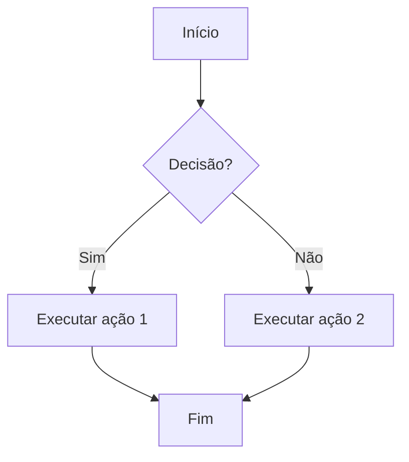

# Teste Completo

Este post serve para testar **todas as funcionalidades** habilitadas no Hugo + PaperMod.

---

## 1. MathJax

Podemos escrever fórmulas matemáticas usando MathJax.

Equação inline: $E = mc^2$

Equação display:

$$
\int_0^\infty e^{-x^2} dx = \frac{\sqrt{\pi}}{2}
$$

---

## 2. Mermaid

Um gráfico de fluxo simples:



## 3. Python

```python
def fibonacci(n):
    """Retorna a sequência de Fibonacci até n"""
    seq = [0, 1]
    while len(seq) < n:
        seq.append(seq[-1] + seq[-2])
    return seq

print(fibonacci(10))
``` 